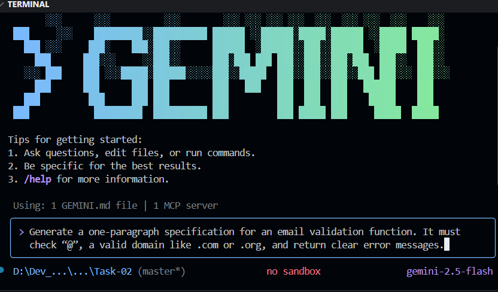
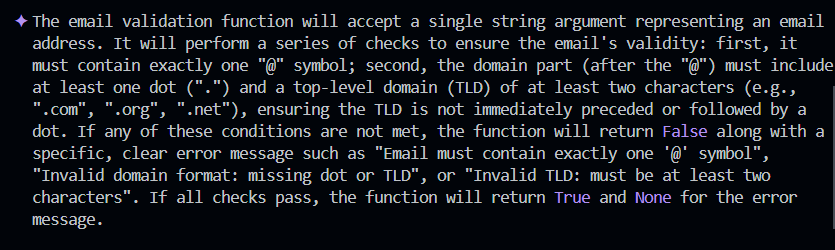

# 🧠 AIDD 30-Day Challenge — Task 2

---

## 📁 Part A — Theory (Short Questions)

### **1. Nine Pillars Understanding**

**Why is using AI Development Agents better for your growth as a system architect?**  
AI agents handle repetitive setup and boilerplate work. This saves your time and allows you to focus more on system design and architecture. Gradually, your thinking evolves from coding-level to system-level.

**How do the Nine Pillars help a developer grow into an M-Shaped Developer?**  
The Nine Pillars cover specifications, testing, automation, planning, agents, and code workflows. This combination prevents you from staying limited to a single skill. You become strong across multiple connected areas, which is the essence of an M-shaped developer.

---

### **2. Vibe Coding vs Specification-Driven Development**

**Why does Vibe Coding create problems after one week?**  
Vibe coding involves zero planning. Over time, the code becomes messy, bugs increase, and maintenance becomes difficult. After a week, the structure breaks down.

**How does Specification-Driven Development prevent those problems?**  
In SDD, all requirements are clear before coding starts. The code remains clean, stable, and easy to update. Future changes are simple because the structure is well-defined.

---

### **3. Architecture Thinking**

**How does architecture-first thinking change the developer’s role?**  
The architecture-first approach doesn’t let the developer remain just a coder. You start thinking like a system designer. The structure comes first, and then development flows smoothly.

**Why must developers think in layers and systems instead of raw code?**  
Layer-based thinking makes the project predictable, scalable, and maintainable. Debugging, updates, and expansion become easy. The system remains clear and the code is not scattered.

---

## 📁 Part B — Practical Task

### **1️⃣ CLI Prompt**

### **2️⃣ AI-Generated Specification**

---

## 📁 Part C — Multiple Choice Questions

### **1. What is the main purpose of Spec-Driven Development?**

- A. Make coding faster  
- B. Clear requirements before coding begins ✅  
- C. Remove developers  
- D. Avoid documentation  

**Correct: B — SDD’s main focus is to clarify requirements before coding begins.**

---

### **2. What is the biggest mindset shift in AI-Driven Development?**

- A. Writing more code manually  
- B. Thinking in systems and giving clear instructions ✅  
- C. Memorizing more syntax  
- D. Working without any tools  

**Correct: B — In the AI era, system-thinking and clear instructions are more important than coding itself.**

---

### **3. Biggest failure of Vibe Coding?**

- A. AI stops responding  
- B. Architecture becomes hard to extend ✅  
- C. Code runs slow  
- D. Fewer comments written  

**Correct: B — Vibe coding makes projects messy and hard to extend in the future.**

---

### **4. Main advantage of using AI CLI agents (like Gemini CLI)?**

- A. They replace the developer completely  
- B. Handle repetitive tasks so the developer can focus on design & problem-solving ✅  
- C. Make coding faster but less reliable  
- D. Make coding optional  

**Correct: B — Agents handle repetitive tasks, allowing you to focus on important design aspects.**

---

### **5. What defines an M-Shaped Developer?**

- A. Knows little about everything  
- B. Deep in only one field  
- C. Deep skills in multiple related domains ✅  
- D. Works without AI tools  

**Correct: C — An M-shaped developer is strong across multiple connected domains.**

---

## 🌟 Reflection

This task clearly demonstrates how the developer’s role is changing in the AI era. Planning, specifications, and the use of agents have become part of the daily workflow alongside coding. Architecture-first thinking transforms the developer into a system-level thinker. Any developer who consistently follows the Nine Pillars and SDD can grow into an M-shaped developer.

---
