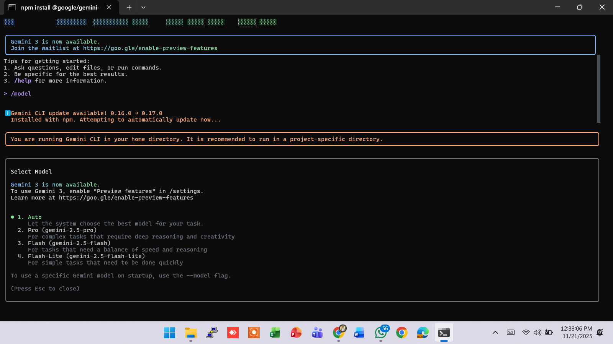
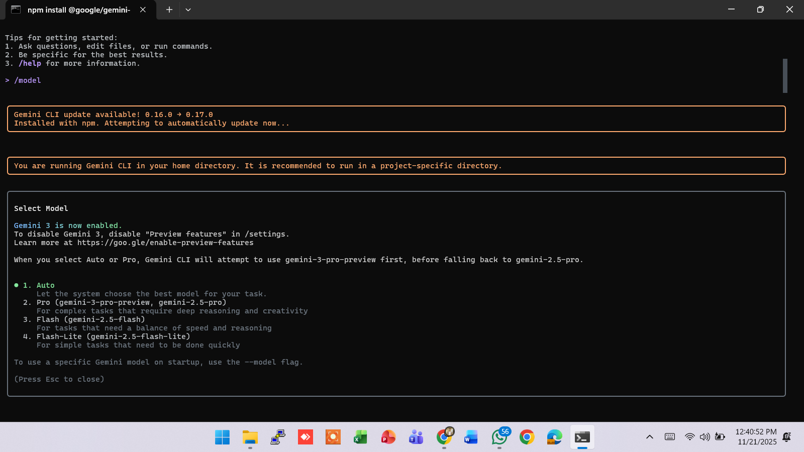

# 🧠 AIDD 30-Day Challenge — Task 3

---

## 🌟 PART A — Research Answers (Short & Simple)

### **1. What new improvements were introduced in Gemini 3.0?**
Gemini 3.0 me reasoning, coding, automation aur multimodal samajhne ko kaafi improve kiya gaya hai.  
Isme High (Deep) Thinking aur Low Thinking ka system add hua hai jo task ki difficulty ke hisab se reasoning adjust karta hai.  
Main model `gemini-3-pro-preview` hai jisme 1M input aur 64k output context window milti hai.

---

### **2. How does Gemini 3.0 improve coding & automation workflows?**
Gemini 3.0 code generation ko zyada accurate banata hai, debugging me help karta hai aur long coding tasks ko agentic workflows ke through automate karta hai.  
Ye multi-file projects, complex functions aur step-by-step instructions ko smooth handle karta hai.

---

### **3. How does Gemini 3.0 improve multimodal understanding?**
Gemini 3.0 text, images, audio, video aur PDFs ko deeply analyze karta hai.  
Ye zoom-level details tak pick karta hai aur previous versions se zyada accurate multimodal response deta hai.  
Mixed media ko combine kar ke relevant aur strong reasoning provide karta hai.

---

### **4. Name any two developer tools introduced with Gemini 3.0.**
- **Gemini CLI** — Command-line interface jisse model test, run aur version switch kiye jate hain.  
- **Gemini Applets** — Small agent-based programs jo tasks ko automate karte hain aur agentic workflows ko easy banate hain.

---

## 🌟 PART B — Practical Task (Screenshot Required)

### 📌 **Step 1: Before Model Update**


### 📌 **Step 2: Updating to Gemini 3.0 Model**
Model Gemini 3 enable karna tha to me /settings me ja kar Preview Features ko enable kiya.  
Phir me /model me gaya taake command ke through model select karun.  
Is process me Gemini CLI automatic uninstall ho gaya.  
Phir mene latest version install kiya:

``` npm i -g @google/gemini-cli@latest ```


### 📌 **Step 3: After Model Update**
 

**Alhamdulillah phir successfully Gemini 3.0 enable ho gaya aur model update ho gaya. ✅**  

**Task 3 Completed Successfully ✅**  

**Alhamdulillah 🤲**

