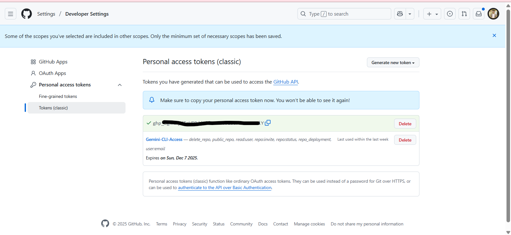
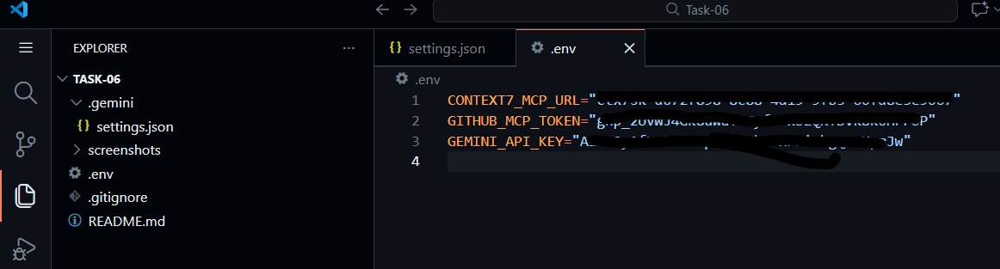
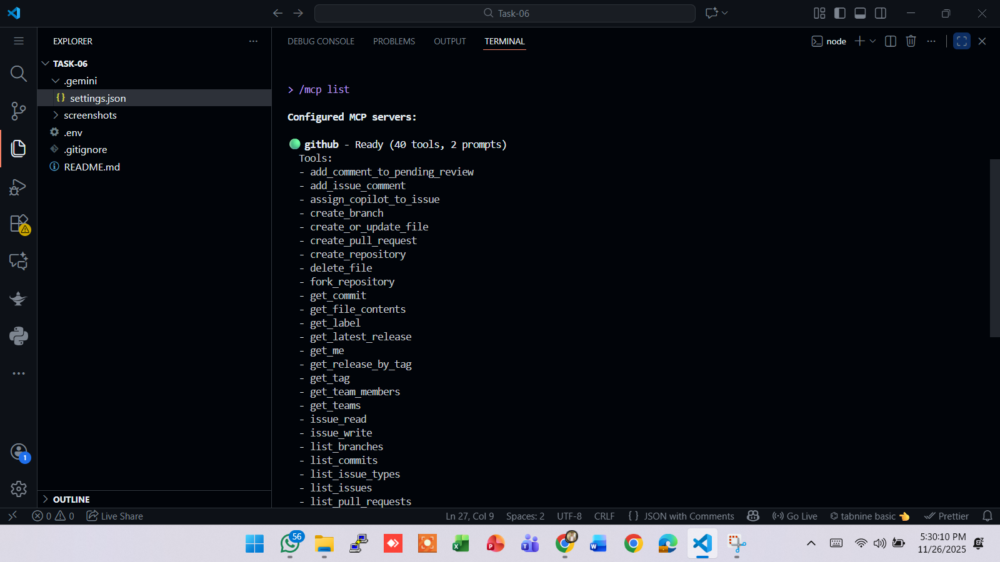
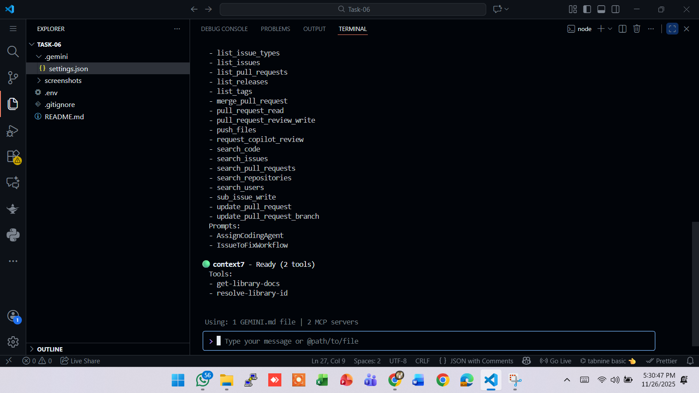
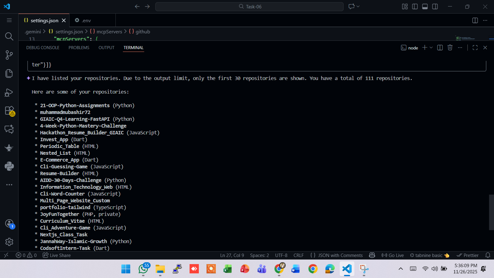

# 🧠 AIDD 30-Day Challenge — Task 6  
**GitHub × MCP Integration (Hosted Method)**

## Overview  
Successfully connected the **GitHub MCP Server** with the **Google Gemini CLI** using the **hosted server method**.  

This setup allows the AI to read repositories, explore files, create new repos, commit & push code, and fully interact with GitHub — **without installing Docker or any MCP manually**.

**Alhamdulillah — Task 6 Fully Completed Within Deadline ✅**

## Completed Requirements

| Requirement                                 | Status | Proof                                                                 |
|---------------------------------------------|--------|-----------------------------------------------------------------------|
| GitHub Personal Access Token (PAT) Created  | ✔      |                              |
| Token Stored Securely in `.env`             | ✔      |                     |
| Gemini Connected With GitHub MCP Server     | ✔      |                  |
| MCP Tools Loaded Successfully (90+ Tools)   | ✔      |                  |
| GitHub Repository List Fetched              | ✔      |  <br>  |

## Project Structure

```
├── README.md
├── settings.json
├── .env
├── screenshots/
│   ├── env_file.png
│   ├── env_file_blurred.png
│   ├── github_mcp_connect.png
│   ├── github_remaining_tools.png
│   ├── repo_list.png
│   └── repo_list_2.png
```
## Additional Work (Extra Effort)  
Along with completing the task, I wrote and published a complete step-by-step tutorial for the community:

🔗 **Medium Article**  
[Complete Guide: Configure GitHub MCP & Create/Publish Repo Using Gemini CLI](https://medium.com/@mubashirkhi72/complete-guide-configure-github-mcp-create-publish-repo-using-gemini-cli-46b4d74698c0?postPublishedType=repub)

Covers:
- GitHub MCP integration from scratch
- Secure PAT creation & storage
- Gemini CLI setup (hosted method)
- Creating and publishing repositories entirely through AI

## Task Status
**Task 6 → Alhamdulillah Completed Successfully 100%**  
All screenshots captured, verified, and uploaded.

