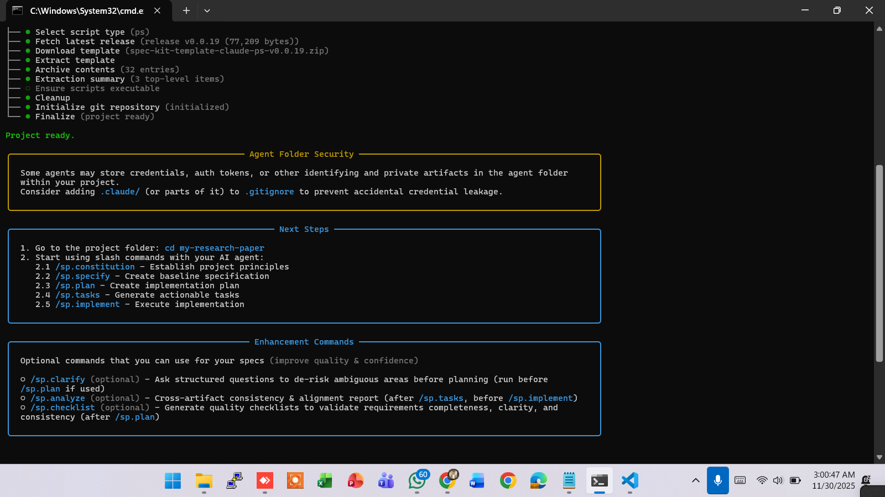
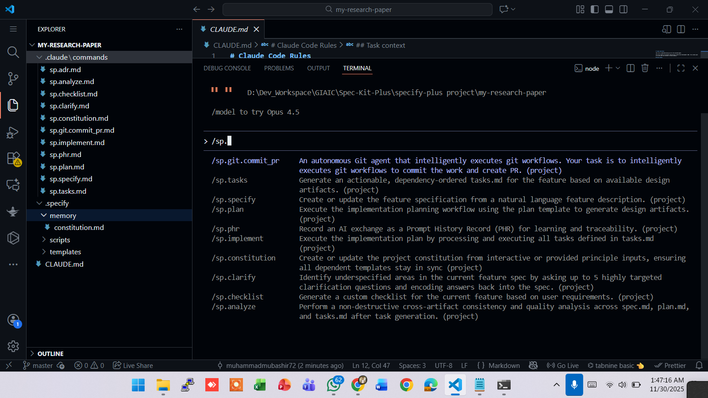

# 🧠 AIDD 30-Day Challenge — Task 7  

⭐ **SPECKit Plus Kya Hai?**  
SPECKit Plus ek simple lekin powerful framework hai jo kisi bhi project ko clear, structured steps me divide karta hai.  
Iska maqsad: Problem samjho → Plan banao → Kaam karo → Result lo.  
Short me: Project ko easy, organized aur successful banata hai.  

**Quick Start / Installation** → [Click here to Install SPECKit Plus](https://ai-native.panaversity.org/docs/SDD-RI-Fundamentals/spec-kit-plus-hands-on/installation-and-setup)

---

### Project Setup in Action  

1. **Project initialize karte waqt**  
     

2. **Project Successfully Created**  
     

3. **Slash command se saare commands dekhne ke liye**  
   `/sp.` likha to saare available commands aa gaye  
     

---

### 1️⃣ Constitution Phase (Foundation)  
Project ki buniyaad yahan banti hai.  
Yahan likha jata hai:  
- Problem kya hai?  
- Users kaun hain?  
- System ka purpose aur goals kya hain?  
- Project ki boundaries (kya karna hai, kya nahi)  

> Simply: “Ye project exist kyun karta hai?”  

→ **Full Detail**: [Constitution Phase](https://ai-native.panaversity.org/docs/SDD-RI-Fundamentals/spec-kit-plus-hands-on/constitution-phase)

---

### 2️⃣ Specify Phase (Requirements)  
Sari requirements ek jagah collect karo:  
- Functional Requirements (system kya karega)  
- Non-functional Requirements (speed, security, etc.)  
- User Stories  
- Acceptance Criteria  

> Simply: “System exactly kya-kya karega, sab clear yahan likho.”  

→ **Full Detail**: [Specify Phase](https://ai-native.panaversity.org/docs/SDD-RI-Fundamentals/spec-kit-plus-hands-on/specify-phase)

---

### 3️⃣ Plan Phase (Structure banao)  
Ab kaam ka complete roadmap banao:  
- Timeline & Milestones  
- System Architecture  
- Modules breakdown  
- Risks aur unka solution  
- Dependencies  

> Simply: “Kaam kab, kaise aur kis order me hoga?”  

→ **Full Detail**: [Plan Phase](https://ai-native.panaversity.org/docs/SDD-RI-Fundamentals/spec-kit-plus-hands-on/plan-phase)

---

### 4️⃣ Tasks Phase (Chhote pieces me todo)  
Poora project chhote-chhote actionable tasks me divide karo.  
Har task me ho:  
- Clear Description  
- Expected Output  
- Dependencies  
- Status (To Do / In Progress / Done)  

> Simply: “Ab har cheez ko karne layak bana do.”  

→ **Full Detail**: [Tasks Phase](https://ai-native.panaversity.org/docs/SDD-RI-Fundamentals/spec-kit-plus-hands-on/tasks-phase)

---

### 5️⃣ Implement Phase (Asli kaam shuru!)  
Yahan coding aur building hoti hai:  
- Code likho  
- Testing karo  
- Bugs fix karo  
- Features add karo  
- Tools integrate karo  

> Simply: “Plan ko real working product banao!”  

→ **Full Detail**: [Implement Phase](https://ai-native.panaversity.org/docs/SDD-RI-Fundamentals/spec-kit-plus-hands-on/implement-phase)

---

**SPECKit Plus = Constitution → Specify → Plan → Tasks → Implement**  
5 steps me koi bhi project smoothly complete ho sakta hai!  

