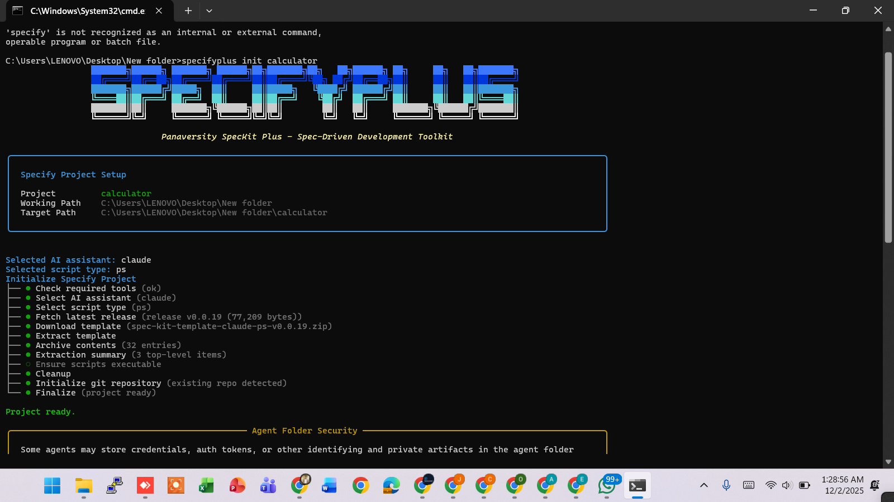
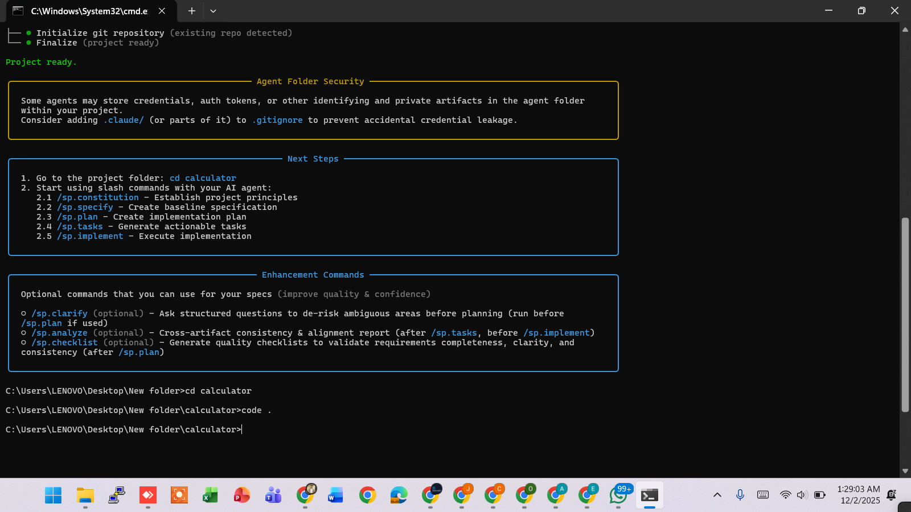
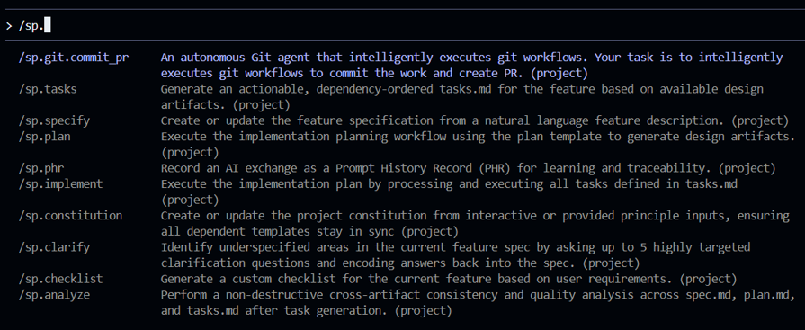
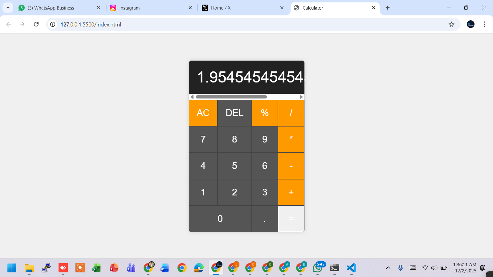
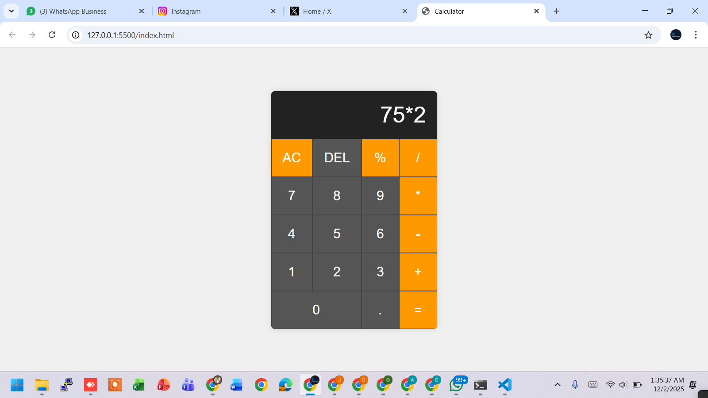
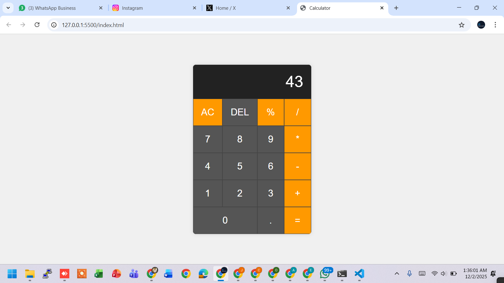

# 🧠 AIDD 30-Day Challenge — Task 8

## 🌟 Task Overview

Build a simple **Calculator Web App** using SPECKitPlus and complete all 5 phases:

1. `/sp.constitution`  
2. `/sp.specify`  
3. `/sp.plan`  
4. `/sp.tasks`  
5. `/sp.implement`  

---

## 📸 Screenshots

**Phase / Project Screenshots:**


1. **Initialization Project Specify**  
     

2. **Project Successfully Created**  
     

3. **Slash command se saare commands dekhne ke liye**  
   `/sp.` likha to saare available commands aa gaye  
     


**Calculator Test Screenshots:**

4. **Division Test and Result**  



4. **Multiply Test and Result**  





---

## ✅ SPECKitPlus Prompts

Perfect — below are **ready-to-paste prompts** for each SPECKit slash command. Copy the entire block for each command into Claude (SPECKit) exactly as shown.

---

### 1) `/sp.constitution`

```

/sp.constitution
Create the base constitution for a small **Calculator Web App**. The constitution should define the app's core purpose, main goals, allowed features, constraints, expected user experience, and non-goals. Keep it concise (4–8 short paragraphs / bullets). Mention accessibility, performance, and offline capability as desired features. Output must be saved as `sp.constitution.md`.

```

---

### 2) `/sp.specify`

```

/sp.specify
Generate a full, detailed technical specification for a **Calculator Web App** implemented with plain **HTML, CSS, and JavaScript** (no frameworks). The spec must include:

* App overview and user stories.
* UI layout: desktop and mobile responsive wireframe description.
* Controls: numeric keys, decimal, + - × ÷, =, Clear (C), Backspace (⌫), +/- toggle, percent (%).
* Input/Output rules and validation.
* Accessibility requirements: keyboard support, ARIA attributes.
* Performance requirements: instant response, offline capability.
* Required files: index.html, styles.css, script.js, README.md.
* Test instructions with screenshots folder (`screenshots/`).

Save output as `sp.specify.md`.

```

---

### 3) `/sp.plan`

```

/sp.plan
Create a practical development plan and timeline for the Calculator Web App (HTML/CSS/JS). Include phases, milestones, and time estimates. Provide a step-by-step checklist for each phase:

1. Design (wireframes + accessibility): 1–2 hours
2. Basic HTML structure: 30–45 minutes
3. CSS layout + responsive rules: 1–2 hours
4. JavaScript core logic: 2–3 hours
5. UI interactions, keyboard support, ARIA: 1 hour
6. Testing and bugfixing (3 test cases + edge cases): 1 hour
7. Packaging and README: 30 minutes

Run commands: `npx http-server .` OR `python -m http.server 5173`.

Save output as `sp.plan.md`.

```

---

### 4) `/sp.tasks`

```

/sp.tasks
Convert the plan into actionable tasks with estimated time and exact deliverables. Example tasks:

* Create HTML skeleton (index.html)
* Create CSS reset and layout (styles.css)
* Implement display update logic (script.js)
* Implement numeric input and operator handling
* Implement special buttons: C, ⌫, +/-, %
* Add keyboard support and ARIA roles
* Handle edge cases (divide by zero, decimals)
* Create 3 test screenshots
* Final README.md

Save as `sp.tasks.md`.

```

---

### 5) `/sp.implement`

```

/sp.implement
Generate a full, working **Calculator Web App** using HTML, CSS, and JavaScript. Include full contents for:

1. index.html — semantic structure, linked styles & script, ARIA attributes.
2. styles.css — responsive layout, grid keypad, high contrast theme.
3. script.js — all functions, keyboard support, error handling, console logs for 3 test cases.
4. README.md — run instructions, features, accessibility notes.
5. screenshots/ — addition.png, multiply.png, divide.png

Save implementation output as `sp.implement.md` and export code files into `ext/` folder.

```

**Alhamdulillah Task 8 Completed ✅**  