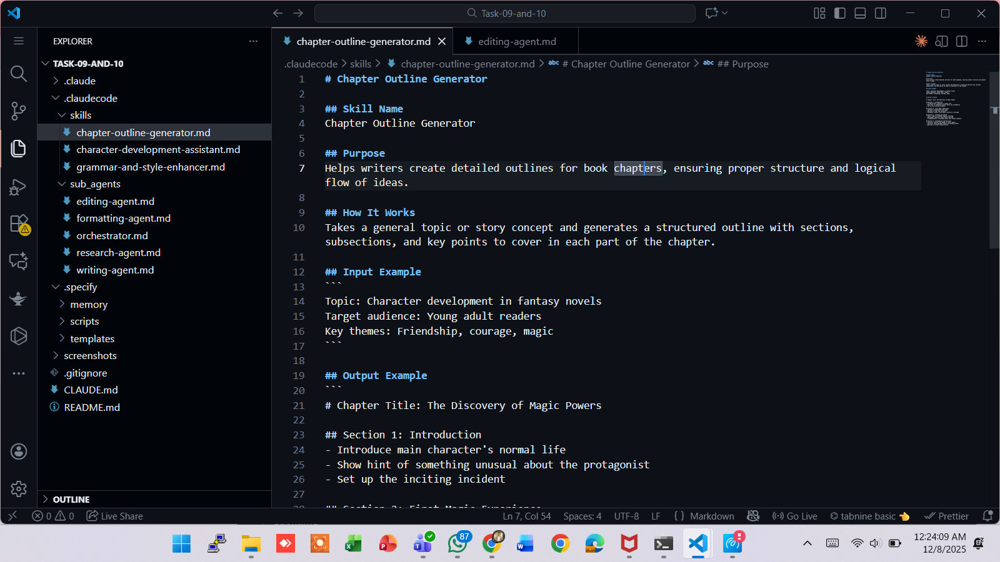
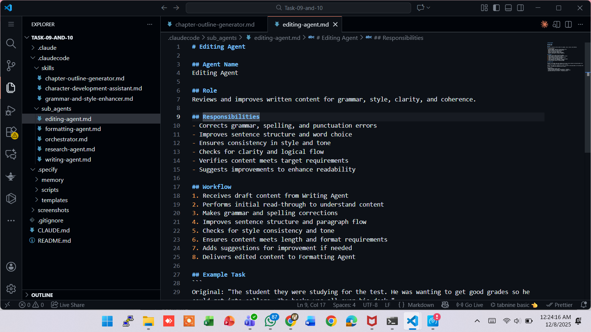

# 🧠 AIDD 30-Day Challenge — Tasks 9 & 10

## 🌟 Task Overview

This project contains the implementation of Tasks 9 and 10 of the 30-Day Challenge:

**Task 9:** Create custom Skills for AI-assisted writing
**Task 10:** Build Sub-Agents and Orchestration system for automated content creation

---

## 📁 Project Structure

This project includes the following directory structure:
```
├── AI-DrivenDevelopment–30-DayChallenges_9_10_task.md
├── README.md
├── .claudecode/
│   ├── skills/
│   │   ├── chapter-outline-generator.md
│   │   ├── character-development-assistant.md
│   │   └── grammar-and-style-enhancer.md
│   └── sub_agents/
│       ├── orchestrator.md
│       ├── research-agent.md
│       ├── writing-agent.md
│       ├── editing-agent.md
│       └── formatting-agent.md
├── screenshots/
```

---

## 📸 Screenshots

**Skills Directory Screenshot:**


**Sub-Agents Directory Screenshot:**


---

## 🛠️ Skills Directory (.claudecode/skills/)

The skills directory contains custom AI-assisted writing tools:

### 1. Chapter Outline Generator (`chapter-outline-generator.md`)
Helps writers create detailed outlines for book chapters, ensuring proper structure and logical flow of ideas.

### 2. Character Development Assistant (`character-development-assistant.md`)
Helps writers create deep, believable characters with clear motivations, backstories, and personality traits.

### 3. Grammar and Style Enhancer (`grammar-and-style-enhancer.md`)
Improves the grammar, sentence structure, and writing style of text to make it clearer and more engaging for readers.

---

## 🤖 Sub-Agents Directory (.claudecode/sub_agents/)

The sub_agents directory contains specialized AI agents for automated content creation:

### 1. Orchestrator (`orchestrator.md`)
Coordinates and manages all other agents in the writing system, making sure they work together effectively.

### 2. Research Agent (`research-agent.md`)
Gathers accurate information, facts, and data to support writing projects.

### 3. Writing Agent (`writing-agent.md`)
Creates original content based on research, outlines, and user requirements.

### 4. Editing Agent (`editing-agent.md`)
Reviews and improves written content for grammar, style, clarity, and coherence.

### 5. Formatting Agent (`formatting-agent.md`)
Applies proper formatting, styling, and presentation to completed content.

---

**Alhamdulillah Tasks 9 & 10 Completed ✅**